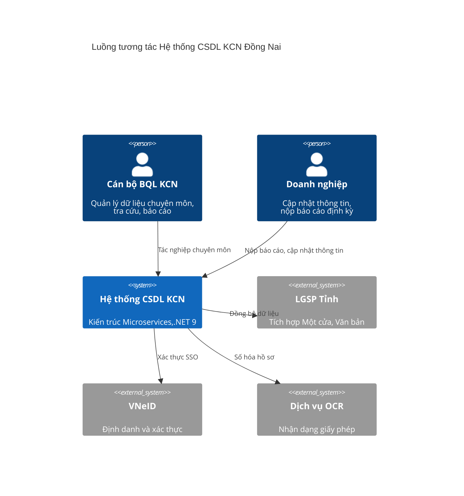
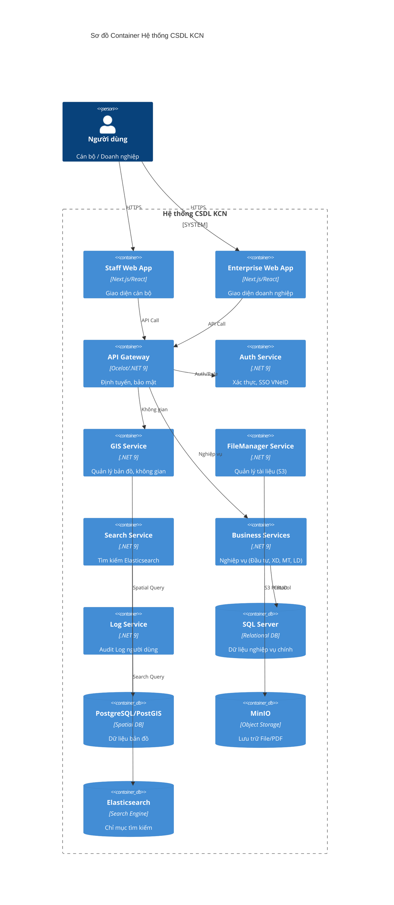

# Tài liệu Đặc tả Kiến trúc và Kỹ thuật
## Hệ thống Quản lý Cơ sở Dữ liệu Ban Quản lý các Khu Công nghiệp tỉnh Đồng Nai

**Phiên bản:** 2.0 (Cập nhật dựa trên phản hồi)  
**Tác giả:** Solution Architect  

---

## 1. Kiến trúc Tổng thể (High-level Architecture)

Hệ thống được thiết kế theo kiến trúc **Microservices** hiện đại, đảm bảo tính sẵn sàng cao (High Availability), khả năng mở rộng (Scalability) và đáp ứng hiệu năng tối thiểu 500 người dùng đồng thời (CCU).

### 1.1. Sơ đồ Ngữ cảnh (System Context - C4 Level 1)

Mô tả sự tương tác giữa hệ thống CSDL KCN với các tác nhân và hệ thống ngoại vi.

### 1.2. Sơ đồ Container (C4 Level 2)

Thể hiện các thành phần logic chính của hệ thống.

---

## 2. Các Dịch vụ Đặc thù (Specific Services)

Hệ thống được module hóa thành các service độc lập để tối ưu hiệu năng và khả năng bảo trì.

| Service | Vai trò & Giải pháp Kỹ thuật |
|---------|---------------------------|
| **Auth Service** | Xác thực tập trung, quản lý User/Role. Tích hợp SSO với VNeID và các hệ thống của tỉnh. |
| **GIS Service** | Quản lý dữ liệu lớp bản đồ. Sử dụng **PostgreSQL với PostGIS** để lưu trữ và truy vấn tọa độ, diện tích, ranh giới các lô đất, hạ tầng KCN. |
| **FileManager Service** | Quản lý file tương tự Dropbox/GDrive. Backend sử dụng **MinIO**. Hỗ trợ phân cấp thư mục, chia sẻ và quản quyền truy cập file. |
| **Search Service** | Xây dựng chỉ mục (indexing) khi dữ liệu nghiệp vụ thay đổi. Sử dụng **Elasticsearch** để tìm kiếm full-text trên dữ liệu doanh nghiệp, dự án và nội dung tài liệu. |
| **Log Service** | Ghi nhật ký toàn bộ hoạt động (Login, Logout, CRUD). Thông tin log được lưu vào DB chuyên dụng để phục vụ tra cứu, giám sát tuân thủ mà không ảnh hưởng hiệu năng DB nghiệp vụ. |
| **OCR Service** | Tiếp nhận File ID từ FileManager/MinIO, thực hiện bóc tách thông tin giấy phép và trả kết quả cấu trúc hóa cho các service tác nghiệp. |
| **LGSP Service** | Tích hợp trục dữ liệu tỉnh để lấy thông tin từ hệ thống Một cửa và Quản lý văn bản hành chính. |
| **Import Số hóa Service** | Tiếp nhận dữ liệu metadata và file PDF từ quy trình số hóa tài liệu bên thứ 3 để đẩy vào hệ thống. |
| **Master Data Service** | Quản lý danh mục dùng chung (Hành chính, loại hình DN, trạng thái dự án...), đảm bảo tính nhất quán dữ liệu toàn hệ thống. |

---

## 3. Giải pháp Kỹ thuật và Ràng buộc

### 3.1. Stack Công nghệ chọn lọc
- **Backend:** .NET Core 9, Entity Framework Core (Code First).
- **Frontend:** Tách biệt 02 Web App riêng (Staff vs Enterprise) sử dụng Next.js/React để tối ưu trải nghiệm và bảo mật.
- **Database:**
  - **SQL Server:** Quản lý dữ liệu quan hệ (Doanh nghiệp, Dự án, Hồ sơ).
  - **PostgreSQL + PostGIS:** Xử lý dữ liệu không gian, bản đồ.
- **Storage:** MinIO (Object Storage) thay thế cho lưu trữ file truyền thống.
- **Search:** Elasticsearch cho tốc độ tìm kiếm dưới 1s trên hàng triệu bản ghi.
- **Deployment:** Docker Container Ready cho toàn bộ services.

### 3.2. Hiệu năng và Khả năng đáp ứng
- **Tối ưu hóa CCU (500+):** Sử dụng Caching (Redis) cho các dữ liệu ít biến động và Master Data.
- **Response Time (<10s):** Áp dụng kiến trúc bất đồng bộ (Asynchronous) cho các tác vụ nặng như OCR, Import, Indexing.

---

## 4. Luồng Thông tin Chính (Overview Data Flows)

### 4.1. Luồng Tiếp nhận và Xử lý Giấy phép (OCR)
1. **Người dùng** upload file qua **FileManager Service** (lưu vào **MinIO**).
2. **Nghiệp vụ Service** gửi yêu cầu OCR kèm File ID sang **OCR Service**.
3. **OCR Service** lấy file từ MinIO, thực hiện bóc tách và trả kết quả JSON.
4. **Nghiệp vụ Service** lưu thông tin vào **SQL Server** và thông báo hoàn tất.

### 4.2. Luồng Tìm kiếm và Tra cứu
1. Khi **Nghiệp vụ Service** cập nhật dữ liệu (DN, Dự án), một bản tin sẽ được gửi để **Search Service** cập nhật chỉ mục trong **Elasticsearch**.
2. **Người dùng** thực hiện tìm kiếm qua **Search Service**.
3. **Search Service** truy vấn Elasticsearch và trả kết quả ngay lập tức.

### 4.3. Luồng Quản lý Bản đồ (GIS)
1. Dữ liệu không gian (tọa độ KCN, lô đất) được quản lý bởi **GIS Service** trong **PostGIS**.
2. **Staff App** yêu cầu bản đồ, **GIS Service** trả về dữ liệu GeoJSON hoặc Vector Tiles.
3. Thông tin nghiệp vụ (thuộc tính doanh nghiệp) được kết nối từ hiệu năng của **SQL Server** thông qua ID duy nhất.

### 4.4. Luồng Ghi nhật ký (Logging)
1. Toàn bộ hành động quan trọng (Auth, CRUD) tại các Service được gửi về **Log Service**.
2. **Log Service** lưu trữ vào Database audit.
3. Quản trị viên tra cứu lịch sử hoạt động trực tiếp thông qua giao diện của **Log Service**.

---

## 5. Chiến lược Vận hành và Triển khai

Hệ thống sẵn sàng triển khai trên hạ tầng Docker:
- Mỗi service là một **Container** độc lập.
- Sử dụng **Docker Compose** cho môi trường Dev/Staging.
- Phiên bản đầu tiên tập trung vào tính ổn định của nghiệp vụ, chưa áp dụng các công cụ giám sát phức tạp như Grafana để giảm thiểu chi phí quản lý vận hành.

---
*Tài liệu được thiết kế nhằm đáp ứng tối đa yêu cầu bám sát nghiệp vụ Ban quản lý KCN tỉnh Đồng Nai.*
