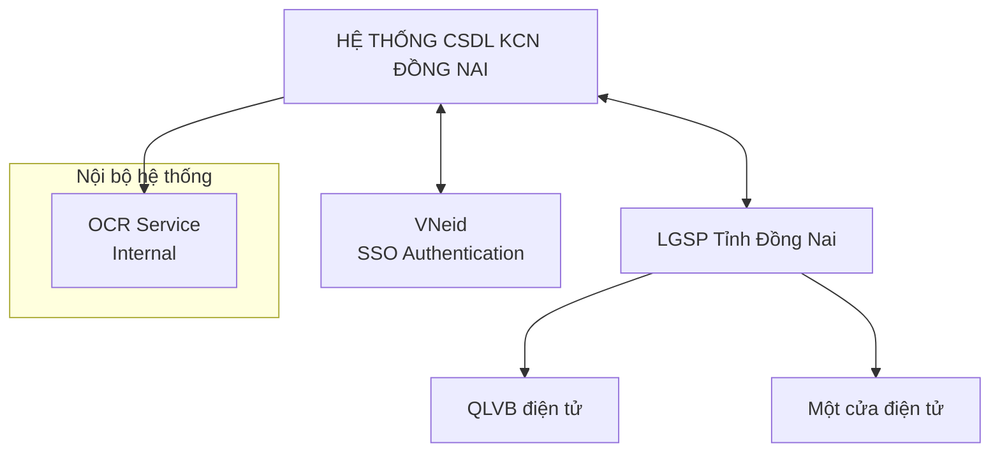
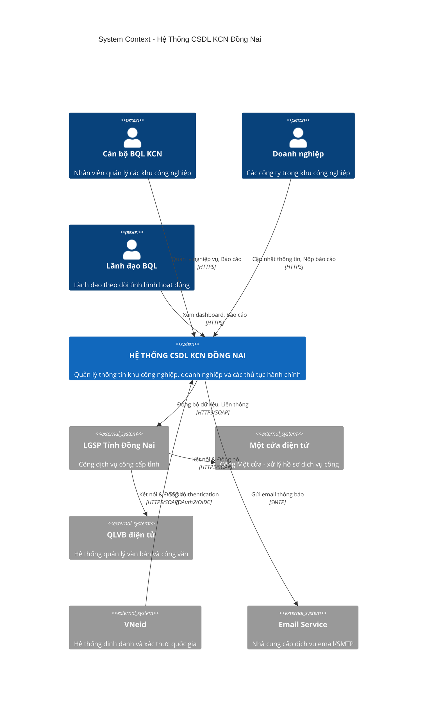
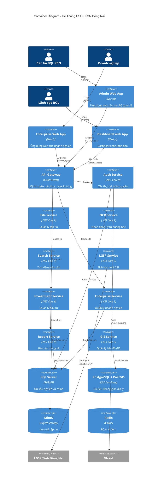

# Đặc Tả Kiến Trúc Hệ Thống
# Phần Mềm Cơ Sở Dữ Liệu Ban Quản Lý Các Khu Công Nghiệp Đồng Nai

**Phiên bản:** 1.0  
**Ngày tạo:** 05/02/2026  
**Tác giả:** Solution Architect

---

## Mục Lục

1. [Tổng Quan](#1-tổng-quan)
2. [Phân Tích Yêu Cầu](#2-phân-tích-yêu-cầu)
3. [Mô Hình Kiến Trúc C4](#3-mô-hình-kiến-trúc-c4)
4. [Chi Tiết Các Microservices](#4-chi-tiết-các-microservices)
5. [Thiết Kế Cơ Sở Dữ Liệu](#5-thiết-kế-cơ-sở-dữ-liệu)
6. [Yêu Cầu Phi Chức Năng](#6-yêu-cầu-phi-chức-năng)
7. [Công Nghệ & Stack Kỹ Thuật](#7-công-nghệ--stack-kỹ-thuật)
8. [Chiến Lược Triển Khai](#8-chiến-lược-triển-khai)

---

## 1. Tổng Quan

### 1.1. Mục Tiêu Dự Án

Xây dựng hệ thống phần mềm cơ sở dữ liệu quản lý các Khu công nghiệp, Khu kinh tế tỉnh Đồng Nai với các mục tiêu:

- Quản lý thông tin **2.100+ doanh nghiệp** trong các KCN
- Số hóa và lưu trữ **~1.4 triệu trang** tài liệu
- Tích hợp, liên thông dữ liệu với các hệ thống của Tỉnh
- Hỗ trợ công tác cấp phép đầu tư, xây dựng, môi trường, lao động

### 1.2. Phạm Vi Hệ Thống

```
┌─────────────────────────────────────────────────────────────────┐
│                    HỆ SINH THÁI SỐ KCN ĐỒNG NAI                │
├─────────────────────────────────────────────────────────────────┤
│  ┌─────────────┐  ┌─────────────┐  ┌─────────────────────────┐  │
│  │  Cán bộ    │  │  Doanh     │  │   Hệ thống bên ngoài    │  │
│  │  BQL KCN   │  │  nghiệp    │  │   (LGSP, Một cửa,       │  │
│  │            │  │            │  │    QLVB, VNeid)         │  │
│  └─────────────┘  └─────────────┘  └─────────────────────────┘  │
│         │               │                    │                  │
│         └───────────────┼────────────────────┘                  │
│                         ▼                                       │
│  ┌─────────────────────────────────────────────────────────┐   │
│  │          PHẦN MỀM QUẢN LÝ CSDL KCN ĐỒNG NAI             │   │
│  │  ┌──────────┬──────────┬──────────┬──────────────────┐  │   │
│  │  │ QL Đầu tư│ QL Môi   │ QL Xây   │ QL Lao động      │  │   │
│  │  │          │ trường   │ dựng     │ & Doanh nghiệp   │  │   │
│  │  └──────────┴──────────┴──────────┴──────────────────┘  │   │
│  │  ┌──────────┬──────────┬──────────┬──────────────────┐  │   │
│  │  │ Báo cáo  │ Tài liệu │ Bản đồ   │ Thanh tra        │  │   │
│  │  │ thống kê │ lưu trữ  │ KCN      │ Kiểm tra         │  │   │
│  │  └──────────┴──────────┴──────────┴──────────────────┘  │   │
│  └─────────────────────────────────────────────────────────┘   │
└─────────────────────────────────────────────────────────────────┘
```

---

## 2. Phân Tích Yêu Cầu

### 2.1. Yêu Cầu Chức Năng Chính

| STT | Nhóm Chức Năng | Mô Tả |
|-----|---------------|-------|
| 1 | **Quản lý Đầu tư** | Quản lý giấy chứng nhận đăng ký đầu tư, điều chỉnh, sáp nhập, chuyển nhượng dự án |
| 2 | **Quản lý Môi trường** | Quản lý ĐTM, giấy phép môi trường, vận hành thử nghiệm công trình BVMT |
| 3 | **Quản lý Xây dựng** | Quản lý giấy phép xây dựng, quy hoạch, thẩm định báo cáo NCKT |
| 4 | **Quản lý Lao động** | Quản lý nội quy, thỏa ước lao động, báo cáo sử dụng lao động |
| 5 | **Quản lý Doanh nghiệp** | Quản lý thông tin DN, thi đua khen thưởng, thanh tra kiểm tra |
| 6 | **Báo cáo thống kê** | Dashboard điều hành, báo cáo định kỳ, cảnh báo |
| 7 | **Lưu trữ tài liệu** | Quản lý, tra cứu tài liệu số hóa |
| 8 | **Tích hợp hệ thống** | Kết nối OCR, QLVB, Một cửa, LGSP, VNeid |

### 2.2. Yêu Cầu Phi Chức Năng

| Yêu Cầu | Chỉ Tiêu |
|---------|----------|
| **Hiệu năng** | ≥ 500 CCU (Concurrent Users) |
| **Thời gian đáp ứng** | < 10 giây/request |
| **Tính sẵn sàng** | 99.5% uptime |
| **Bảo mật** | Cấp độ 3 theo NĐ 85/2016 |
| **Khả năng mở rộng** | Horizontal scaling |
| **Dữ liệu** | ~1.4 triệu trang tài liệu |

### 2.3. Các Hệ Thống Tích Hợp



**Các hệ thống tích hợp:**

| Hệ thống | Loại | Mục đích |
|----------|------|----------|
| **VNeid** | External | Xác thực SSO, định danh quốc gia |
| **LGSP Tỉnh Đồng Nai** | External | Cổng dịch vụ công, liên thông dữ liệu |
| **QLVB điện tử** | External | Quản lý văn bản điện tử |
| **Một cửa điện tử** | External | Dịch vụ công trực tuyến |
| **OCR Service** | Internal | Nhận dạng ký tự quang học, số hóa tài liệu |

---

## 3. Mô Hình Kiến Trúc C4

### 3.1. Level 1: System Context Diagram



### 3.2. Level 2: Container Diagram



---

## 4. Tổng Quan Các Microservices

### 4.1. Core Services (Platform Services)

Các dịch vụ nền tảng cung cấp chức năng chung cho toàn hệ thống:

| Service | Mô Tả | Trách Nhiệm |
|---------|-------|-------------|
| **Auth Service** | Xác thực & Phân quyền | • SSO với VNeid<br/>• Quản lý người dùng<br/>• Phân quyền RBAC<br/>• JWT Token |
| **Master Data Service** | Danh mục dùng chung | • Danh mục hành chính<br/>• Khu công nghiệp<br/>• Ngành nghề kinh tế<br/>• Đồng bộ từ LGSP |
| **File Service** | Quản lý tệp tin | • Upload/Download<br/>• Phân quyền truy cập<br/>• Tích hợp MinIO<br/>• Share files |
| **Notification Service** | Gửi thông báo | • Email notification<br/>• In-app notification<br/>• Push notification<br/>• Templates |
| **OCR Service** | Nhận dạng ký tự quang học | • Xử lý 20 mẫu nhận dạng<br/>• Bóc tách dữ liệu<br/>• Queue management<br/>• 250,000 trang/năm |
| **Search Service** | Tìm kiếm toàn văn | • Full-text search<br/>• Elasticsearch backend<br/>• Indexing<br/>• Analytics |
| **LGSP Service** | Tích hợp hệ thống Tỉnh | • Đồng bộ Một cửa<br/>• Đồng bộ QLVB<br/>• Data exchange<br/>• API Gateway |

### 4.2. Business Services (Domain Services)

Các dịch vụ nghiệp vụ theo từng lĩnh vực quản lý:

| Service | Mô Tả | Chức Năng Chính |
|---------|-------|-----------------|
| **Investment Service** | Quản lý Đầu tư | • GCNĐKĐT cấp mới/điều chỉnh<br/>• Sáp nhập/Chuyển nhượng dự án<br/>• Quản lý nhà đầu tư |
| **Environment Service** | Quản lý Môi trường | • Đánh giá tác động môi trường<br/>• Giấy phép môi trường<br/>• VHTN công trình BVMT |
| **Construction Service** | Quản lý Xây dựng | • Giấy phép xây dựng<br/>• Quản lý quy hoạch<br/>• Thẩm định báo cáo NCKT |
| **Labor Service** | Quản lý Lao động | • Nội quy lao động<br/>• Thỏa ước lao động<br/>• Báo cáo sử dụng lao động |
| **Enterprise Service** | Quản lý Doanh nghiệp | • Thông tin doanh nghiệp<br/>• Thi đua khen thưởng<br/>• Trạng thái hoạt động |
| **Inspection Service** | Thanh tra Kiểm tra | • Quản lý thanh tra<br/>• Vi phạm và xử phạt<br/>• Theo dõi thực hiện |
| **Report Service** | Báo cáo Thống kê | • Dashboard điều hành<br/>• Báo cáo định kỳ<br/>• Cảnh báo hệ thống |
| **GIS Service** | Bản đồ GIS | • Bản đồ khu công nghiệp<br/>• Vị trí doanh nghiệp<br/>• Spatial queries |

### 4.3. Kiến Trúc Microservices

```mermaid
graph TB
    subgraph "API Layer"
        GW[API Gateway]
    end
    
    subgraph "Core Services"
        AUTH[Auth Service]
        MASTER[Master Data Service]
        FILE[File Service]
        NOTIFY[Notification Service]
        OCR[OCR Service]
        SEARCH[Search Service]
        LGSP[LGSP Service]
    end
    
    subgraph "Business Services"
        INV[Investment Service]
        ENV[Environment Service]
        CONST[Construction Service]
        LABOR[Labor Service]
        ENT[Enterprise Service]
        INSP[Inspection Service]
        RPT[Report Service]
        GIS[GIS Service]
    end
    
    subgraph "Data Layer"
        SQL[(SQL Server)]
        POSTGRES[(PostgreSQL + PostGIS)]
        ELASTIC[(Elasticsearch)]
        MINIO[(MinIO)]
        REDIS[(Redis)]
        RABBIT[(RabbitMQ)]
    end
    
    GW --> AUTH
    GW --> MASTER
    GW --> FILE
    GW --> NOTIFY
    GW --> OCR
    GW --> SEARCH
    GW --> LGSP
    
    GW --> INV
    GW --> ENV
    GW --> CONST
    GW --> LABOR
    GW --> ENT
    GW --> INSP
    GW --> RPT
    GW --> GIS
    
    AUTH --> SQL
    MASTER --> SQL
    FILE --> SQL
    FILE --> MINIO
    
    INV --> SQL
    ENV --> SQL
    CONST --> SQL
    LABOR --> SQL
    ENT --> SQL
    INSP --> SQL
    RPT --> SQL
    
    GIS --> POSTGRES
    SEARCH --> ELASTIC
    AUTH --> REDIS
    NOTIFY --> RABBIT
```



---

## 5. Thiết Kế Cơ Sở Dữ Liệu

### 5.1. Phân Bổ Database

```
┌─────────────────────────────────────────────────────────────────────┐
│                    DATABASE ARCHITECTURE                            │
├─────────────────────────────────────────────────────────────────────┤
│                                                                     │
│   SQL SERVER CLUSTER (Primary Relational Database)                  │
│   ─────────────────────────────────────────────                    │
│   ┌─────────────┐  ┌─────────────┐  ┌─────────────┐                │
│   │   AuthDB    │  │ MasterDataDB│  │  FileMetaDB │                │
│   │             │  │             │  │             │                │
│   │ • Users     │  │ • Categories│  │ • Files     │                │
│   │ • Roles     │  │ • KCN       │  │ • Folders   │                │
│   │ • Perms     │  │ • Industries│  │ • Shares    │                │
│   └─────────────┘  └─────────────┘  └─────────────┘                │
│                                                                     │
│   ┌─────────────┐  ┌─────────────┐  ┌─────────────┐                │
│   │InvestmentDB │  │EnvironmentDB│  │ConstructionDB│               │
│   │             │  │             │  │             │                │
│   │ • Projects  │  │ • EIA       │  │ • Permits   │                │
│   │ • Certs     │  │ • Licenses  │  │ • Buildings │                │
│   │ • Investors │  │ • Trials    │  │ • Planning  │                │
│   └─────────────┘  └─────────────┘  └─────────────┘                │
│                                                                     │
│   ┌─────────────┐  ┌─────────────┐  ┌─────────────┐                │
│   │  LaborDB    │  │ EnterpriseDB│  │ InspectionDB│                │
│   │             │  │             │  │             │                │
│   │ • Regulations│ │ • Enterprises│ │ • Inspections│               │
│   │ • Agreements│  │ • Rewards   │  │ • Violations│                │
│   │ • Reports   │  │ • Locations │  │ • Penalties │                │
│   └─────────────┘  └─────────────┘  └─────────────┘                │
│                                                                     │
│   ┌─────────────┐  ┌─────────────┐                                 │
│   │  ReportDB   │  │  NotifyDB   │                                 │
│   │             │  │             │                                 │
│   │ • Reports   │  │ • Templates │                                 │
│   │ • Alerts    │  │ • Notifs    │                                 │
│   │ • Periods   │  │ • History   │                                 │
│   └─────────────┘  └─────────────┘                                 │
│                                                                     │
├─────────────────────────────────────────────────────────────────────┤
│                                                                     │
│   POSTGRESQL + POSTGIS (Spatial Database)                          │
│   ─────────────────────────────────────────                        │
│   ┌─────────────────────────────────────────┐                      │
│   │              GIS_DB                      │                      │
│   │                                          │                      │
│   │  • IndustrialZones (Ranh giới KCN)      │                      │
│   │  • EnterprisePlots (Thửa đất DN)        │                      │
│   │  • EnterpriseLocations (Tọa độ)         │                      │
│   │  • MapLayers (Các lớp bản đồ)           │                      │
│   └─────────────────────────────────────────┘                      │
│                                                                     │
├─────────────────────────────────────────────────────────────────────┤
│                                                                     │
│   ELASTICSEARCH (Search & Analytics)                               │
│   ─────────────────────────────────────                            │
│   ┌─────────────────────────────────────────┐                      │
│   │           search_index                   │                      │
│   │                                          │                      │
│   │  • enterprises_idx                       │                      │
│   │  • projects_idx                          │                      │
│   │  • documents_idx                         │                      │
│   │  • audit_logs_idx                        │                      │
│   └─────────────────────────────────────────┘                      │
│                                                                     │
├─────────────────────────────────────────────────────────────────────┤
│                                                                     │
│   MINIO (Object Storage)                                           │
│   ──────────────────────                                           │
│   ┌─────────────────────────────────────────┐                      │
│   │           file_storage                   │                      │
│   │                                          │                      │
│   │  • documents/ (Tài liệu số hóa)         │                      │
│   │  • attachments/ (File đính kèm)         │                      │
│   │  • archives/ (Lưu trữ)                  │                      │
│   │  • temp/ (Temporary files)              │                      │
│   └─────────────────────────────────────────┘                      │
│                                                                     │
├─────────────────────────────────────────────────────────────────────┤
│                                                                     │
│   REDIS (Caching & Session)                                        │
│   ─────────────────────────                                        │
│   ┌─────────────────────────────────────────┐                      │
│   │           cache_cluster                  │                      │
│   │                                          │                      │
│   │  • session:* (User sessions)            │                      │
│   │  • cache:* (API response cache)         │                      │
│   │  • rate:* (Rate limiting)               │                      │
│   │  • lock:* (Distributed locks)           │                      │
│   └─────────────────────────────────────────┘                      │
│                                                                     │
└─────────────────────────────────────────────────────────────────────┘
```

### 5.2. Mô Hình Entity Relationship (Core Entities)

```
┌──────────────────────────────────────────────────────────────────────────┐
│                      CORE ENTITY RELATIONSHIP                            │
└──────────────────────────────────────────────────────────────────────────┘

                    ┌─────────────────┐
                    │   Industrial    │
                    │     Zone        │
                    │  (Khu CN)       │
                    └────────┬────────┘
                             │1
                             │
                             │*
         ┌───────────────────┴───────────────────┐
         │                                       │
         ▼                                       ▼
┌─────────────────┐                    ┌─────────────────┐
│   Enterprise    │                    │    Project      │
│  (Doanh nghiệp) │◄───────────────────│    (Dự án)      │
└────────┬────────┘         *      1   └────────┬────────┘
         │                                      │
         │                                      │
    ┌────┴────┐                         ┌──────┴──────┐
    │         │                         │             │
    ▼         ▼                         ▼             ▼
┌─────────┐ ┌─────────┐           ┌─────────┐   ┌─────────┐
│ Labor   │ │ Reward  │           │Investment│   │ Environ │
│ Report  │ │(Khen    │           │ Cert     │   │ License │
│         │ │ thưởng) │           │(GCNĐKĐT) │   │(GP MT)  │
└─────────┘ └─────────┘           └─────────┘   └─────────┘
                                        │             │
                                        ▼             ▼
                                  ┌─────────┐   ┌─────────┐
                                  │Adjustment│  │  EIA    │
                                  │(Điều chỉnh)│ │ (ĐTM)   │
                                  └─────────┘   └─────────┘

┌─────────────────┐         ┌─────────────────┐
│  Construction   │         │   Inspection    │
│    Permit       │         │  (Thanh tra)    │
│   (GP XD)       │         │                 │
└────────┬────────┘         └────────┬────────┘
         │                           │
         ▼                           ▼
┌─────────────────┐         ┌─────────────────┐
│    Building     │         │   Violation     │
│  (Công trình)   │         │   (Vi phạm)     │
└─────────────────┘         └─────────────────┘
```

---

## 6. Yêu Cầu Phi Chức Năng

### 6.1. Hiệu Năng (Performance)

| Chỉ số | Yêu cầu | Giải pháp |
|--------|---------|-----------|
| **CCU** | ≥ 500 users | Load balancing, Horizontal scaling |
| **Response Time** | < 10s/request | Redis caching, Query optimization |
| **Throughput** | 100 req/sec | API Gateway rate limiting |
| **Database** | < 100ms query | Index optimization, Read replicas |

### 6.2. Bảo Mật (Security)

```
┌────────────────────────────────────────────────────────────────┐
│                    SECURITY LAYERS                             │
├────────────────────────────────────────────────────────────────┤
│                                                                │
│  Layer 1: NETWORK SECURITY                                     │
│  ─────────────────────────                                    │
│  • Firewall (DMZ configuration)                               │
│  • SSL/TLS encryption (HTTPS)                                 │
│  • VPN for remote administration                              │
│  • IP whitelisting                                            │
│                                                                │
├────────────────────────────────────────────────────────────────┤
│                                                                │
│  Layer 2: APPLICATION SECURITY                                 │
│  ─────────────────────────────                                │
│  • JWT authentication                                         │
│  • RBAC authorization                                         │
│  • Input validation (SQL Injection, XSS prevention)           │
│  • CSRF protection                                            │
│  • Rate limiting                                              │
│                                                                │
├────────────────────────────────────────────────────────────────┤
│                                                                │
│  Layer 3: DATA SECURITY                                        │
│  ──────────────────────                                       │
│  • Encryption at rest (AES-256)                               │
│  • Encryption in transit (TLS 1.3)                            │
│  • Password hashing (bcrypt + salt)                           │
│  • Database access control                                    │
│  • Audit logging                                              │
│                                                                │
├────────────────────────────────────────────────────────────────┤
│                                                                │
│  Layer 4: COMPLIANCE                                           │
│  ───────────────────                                          │
│  • Cấp độ 3 theo NĐ 85/2016                                   │
│  • Thông tư 12/2022/TT-BTTTT                                  │
│  • TCVN về an toàn thông tin                                  │
│                                                                │
└────────────────────────────────────────────────────────────────┘
```

### 6.3. Tính Sẵn Sàng (Availability)

| Thành phần | Chiến lược HA |
|------------|---------------|
| **API Gateway** | Active-Active với Load Balancer |
| **Microservices** | Multiple replicas (min 2) |
| **SQL Server** | Always On Availability Groups |
| **Redis** | Redis Cluster (3 nodes) |
| **Elasticsearch** | 3-node cluster |
| **MinIO** | Distributed mode (4+ nodes) |

### 6.4. Khả Năng Mở Rộng (Scalability)

```
┌────────────────────────────────────────────────────────────────┐
│                    SCALING STRATEGY                            │
├────────────────────────────────────────────────────────────────┤
│                                                                │
│  HORIZONTAL SCALING                                            │
│  ──────────────────                                           │
│                                                                │
│  ┌─────────┐  ┌─────────┐  ┌─────────┐                        │
│  │ Service │  │ Service │  │ Service │  ... Auto-scale        │
│  │ Pod 1   │  │ Pod 2   │  │ Pod N   │      based on metrics  │
│  └─────────┘  └─────────┘  └─────────┘                        │
│       │           │           │                               │
│       └───────────┼───────────┘                               │
│                   │                                            │
│             ┌─────▼─────┐                                      │
│             │   Load    │                                      │
│             │  Balancer │                                      │
│             └───────────┘                                      │
│                                                                │
├────────────────────────────────────────────────────────────────┤
│                                                                │
│  DATABASE SCALING                                              │
│  ────────────────                                             │
│                                                                │
│  ┌───────────────────────────────────────────┐                │
│  │              SQL Server                    │                │
│  │  ┌─────────┐      ┌─────────┐            │                │
│  │  │ Primary │─────►│ Read    │ x N        │                │
│  │  │  (Write)│      │ Replica │            │                │
│  │  └─────────┘      └─────────┘            │                │
│  └───────────────────────────────────────────┘                │
│                                                                │
└────────────────────────────────────────────────────────────────┘
```

---

## 7. Công Nghệ & Stack Kỹ Thuật

### 7.1. Technology Stack

```
┌────────────────────────────────────────────────────────────────┐
│                    TECHNOLOGY STACK                            │
├────────────────────────────────────────────────────────────────┤
│                                                                │
│  FRONTEND                                                      │
│  ────────                                                     │
│  • Framework: Next.js 14+ / Angular 17+                       │
│  • Language: TypeScript 5.0+                                  │
│  • UI Library: Ant Design / Material UI                       │
│  • State Management: Redux Toolkit / Zustand                  │
│  • Map: Leaflet / OpenLayers                                  │
│  • Charts: ECharts / Chart.js                                 │
│                                                                │
├────────────────────────────────────────────────────────────────┤
│                                                                │
│  BACKEND                                                       │
│  ───────                                                      │
│  • Framework: .NET Core 9.0                                   │
│  • Language: C# 12                                            │
│  • ORM: Entity Framework Core 9                               │
│  • API: ASP.NET Core Web API                                  │
│  • API Gateway: YARP / Ocelot                                 │
│  • Authentication: IdentityServer / Keycloak                  │
│                                                                │
├────────────────────────────────────────────────────────────────┤
│                                                                │
│  DATABASE                                                      │
│  ────────                                                     │
│  • Primary: SQL Server 2022                                   │
│  • Spatial: PostgreSQL 16 + PostGIS 3.4                       │
│  • Search: Elasticsearch 8.x                                  │
│  • Cache: Redis 7.x                                           │
│  • Object Storage: MinIO                                      │
│  • Message Queue: RabbitMQ 3.x                                │
│                                                                │
├────────────────────────────────────────────────────────────────┤
│                                                                │
│  INFRASTRUCTURE                                                │
│  ──────────────                                               │
│  • Container: Docker 24+                                      │
│  • Orchestration: Docker Compose / Kubernetes                 │
│  • Reverse Proxy: Nginx                                       │
│  • OS: Linux (Ubuntu 22.04 LTS)                               │
│  • CI/CD: GitLab CI / Azure DevOps                            │
│                                                                │
├────────────────────────────────────────────────────────────────┤
│                                                                │
│  MONITORING & LOGGING                                          │
│  ───────────────────                                          │
│  • Logging: Seq / ELK Stack                                   │
│  • Monitoring: Prometheus + Grafana                           │
│  • Tracing: Jaeger / Zipkin                                   │
│  • Health Checks: ASP.NET Core Health Checks                  │
│                                                                │
└────────────────────────────────────────────────────────────────┘
```

### 7.2. Development Tools

| Công cụ | Phiên bản | Mục đích |
|---------|-----------|----------|
| **Visual Studio** | 2022 Professional+ | IDE chính |
| **VS Code** | Latest | Frontend development |
| **Git** | Latest | Version control |
| **GitLab/GitHub** | Latest | Source code repository |
| **Jira** | Cloud | Project management |
| **Postman** | Latest | API testing |
| **DBeaver** | Latest | Database management |

---

## 8. Chiến Lược Triển Khai

### 8.1. Deployment Architecture

```
┌────────────────────────────────────────────────────────────────────────────┐
│                         DEPLOYMENT ARCHITECTURE                             │
│                    (On-Premise - BQL KCN Đồng Nai)                        │
└────────────────────────────────────────────────────────────────────────────┘

┌────────────────────────────────────────────────────────────────────────────┐
│                              INTERNET                                       │
└───────────────────────────────┬────────────────────────────────────────────┘
                                │
                       ┌────────▼────────┐
                       │    Firewall     │
                       │   (DMZ Zone)    │
                       └────────┬────────┘
                                │
┌───────────────────────────────┼────────────────────────────────────────────┐
│                     DMZ ZONE  │                                            │
│                               │                                            │
│  ┌────────────────────────────▼────────────────────────────────────────┐  │
│  │                    NGINX (Reverse Proxy)                             │  │
│  │                    Load Balancer + SSL Termination                   │  │
│  └────────────────────────────┬────────────────────────────────────────┘  │
│                               │                                            │
│  ┌────────────────────────────┼────────────────────────────────────────┐  │
│  │                            ▼                                         │  │
│  │  ┌─────────────┐  ┌─────────────┐  ┌─────────────┐                 │  │
│  │  │ Admin App   │  │Enterprise   │  │ API Gateway │                 │  │
│  │  │ (Next.js)   │  │App (Next.js)│  │  (YARP)     │                 │  │
│  │  │   :3000     │  │   :3001     │  │   :8080     │                 │  │
│  │  └─────────────┘  └─────────────┘  └──────┬──────┘                 │  │
│  │                                           │                         │  │
│  └───────────────────────────────────────────┼─────────────────────────┘  │
│                                              │                            │
└──────────────────────────────────────────────┼────────────────────────────┘
                                               │
┌──────────────────────────────────────────────┼────────────────────────────┐
│                    INTERNAL ZONE             │                            │
│                                              │                            │
│  ┌───────────────────────────────────────────▼─────────────────────────┐  │
│  │                     DOCKER HOST CLUSTER                              │  │
│  │                                                                      │  │
│  │  ┌─────────────────────────────────────────────────────────────┐   │  │
│  │  │                CORE SERVICES CONTAINERS                      │   │  │
│  │  │                                                              │   │  │
│  │  │ ┌─────────┐ ┌─────────┐ ┌─────────┐ ┌─────────┐ ┌─────────┐│   │  │
│  │  │ │  Auth   │ │ Master  │ │  File   │ │ Notify  │ │   Log   ││   │  │
│  │  │ │ Service │ │  Data   │ │ Manager │ │ Service │ │ Service ││   │  │
│  │  │ │ :5001   │ │ :5002   │ │ :5003   │ │ :5004   │ │ :5005   ││   │  │
│  │  │ └─────────┘ └─────────┘ └─────────┘ └─────────┘ └─────────┘│   │  │
│  │  │                                                              │   │  │
│  │  │ ┌─────────┐ ┌─────────┐ ┌─────────┐ ┌─────────┐            │   │  │
│  │  │ │ Search  │ │   OCR   │ │ Import  │ │  LGSP   │            │   │  │
│  │  │ │ Service │ │ Service │ │ Service │ │ Service │            │   │  │
│  │  │ │ :5006   │ │ :5007   │ │ :5008   │ │ :5009   │            │   │  │
│  │  │ └─────────┘ └─────────┘ └─────────┘ └─────────┘            │   │  │
│  │  │                                                              │   │  │
│  │  └──────────────────────────────────────────────────────────────┘   │  │
│  │                                                                      │  │
│  │  ┌─────────────────────────────────────────────────────────────┐   │  │
│  │  │               BUSINESS SERVICES CONTAINERS                   │   │  │
│  │  │                                                              │   │  │
│  │  │ ┌─────────┐ ┌─────────┐ ┌─────────┐ ┌─────────┐            │   │  │
│  │  │ │Investmt │ │ Environ │ │Construct│ │  Labor  │            │   │  │
│  │  │ │ Service │ │ Service │ │ Service │ │ Service │            │   │  │
│  │  │ │ :5101   │ │ :5102   │ │ :5103   │ │ :5104   │            │   │  │
│  │  │ └─────────┘ └─────────┘ └─────────┘ └─────────┘            │   │  │
│  │  │                                                              │   │  │
│  │  │ ┌─────────┐ ┌─────────┐ ┌─────────┐ ┌─────────┐            │   │  │
│  │  │ │Enterpris│ │Inspectio│ │ Report  │ │   GIS   │            │   │  │
│  │  │ │ Service │ │ Service │ │ Service │ │ Service │            │   │  │
│  │  │ │ :5105   │ │ :5106   │ │ :5107   │ │ :5108   │            │   │  │
│  │  │ └─────────┘ └─────────┘ └─────────┘ └─────────┘            │   │  │
│  │  │                                                              │   │  │
│  │  └──────────────────────────────────────────────────────────────┘   │  │
│  │                                                                      │  │
│  └──────────────────────────────────────────────────────────────────────┘  │
│                                                                            │
│  ┌─────────────────────────────────────────────────────────────────────┐  │
│  │                      DATA LAYER CONTAINERS                           │  │
│  │                                                                      │  │
│  │  ┌─────────────┐  ┌─────────────┐  ┌─────────────┐                 │  │
│  │  │ SQL Server  │  │ PostgreSQL  │  │Elasticsearch│                 │  │
│  │  │  (Primary)  │  │ + PostGIS   │  │  Cluster    │                 │  │
│  │  │   :1433     │  │   :5432     │  │ :9200/:9300 │                 │  │
│  │  └─────────────┘  └─────────────┘  └─────────────┘                 │  │
│  │                                                                      │  │
│  │  ┌─────────────┐  ┌─────────────┐  ┌─────────────┐                 │  │
│  │  │   MinIO     │  │   Redis     │  │  RabbitMQ   │                 │  │
│  │  │ (S3 Storage)│  │  (Cache)    │  │ (Message Q) │                 │  │
│  │  │   :9000     │  │   :6379     │  │   :5672     │                 │  │
│  │  └─────────────┘  └─────────────┘  └─────────────┘                 │  │
│  │                                                                      │  │
│  └─────────────────────────────────────────────────────────────────────┘  │
│                                                                            │
│  ┌─────────────────────────────────────────────────────────────────────┐  │
│  │                    MONITORING & LOGGING                              │  │
│  │                                                                      │  │
│  │  ┌─────────────┐  ┌─────────────┐  ┌─────────────┐                 │  │
│  │  │  Prometheus │  │   Grafana   │  │  Seq/ELK    │                 │  │
│  │  │   :9090     │  │   :3000     │  │   :5341     │                 │  │
│  │  └─────────────┘  └─────────────┘  └─────────────┘                 │  │
│  │                                                                      │  │
│  └─────────────────────────────────────────────────────────────────────┘  │
│                                                                            │
└────────────────────────────────────────────────────────────────────────────┘
```

### 8.2. Docker Compose Structure

```yaml
# docker-compose.yml (Simplified)
version: '3.8'

services:
  # ============ INFRASTRUCTURE ============
  nginx:
    image: nginx:latest
    ports:
      - "80:80"
      - "443:443"
    depends_on:
      - api-gateway
      - admin-web
      - enterprise-web

  api-gateway:
    image: axdd/api-gateway:latest
    ports:
      - "8080:8080"
    environment:
      - ASPNETCORE_ENVIRONMENT=Production

  # ============ WEB APPLICATIONS ============
  admin-web:
    image: axdd/admin-web:latest
    ports:
      - "3000:3000"

  enterprise-web:
    image: axdd/enterprise-web:latest
    ports:
      - "3001:3001"

  # ============ CORE SERVICES ============
  auth-service:
    image: axdd/auth-service:latest
    ports:
      - "5001:5001"
    depends_on:
      - sqlserver
      - redis

  master-data-service:
    image: axdd/master-data-service:latest
    ports:
      - "5002:5002"

  file-manager-service:
    image: axdd/file-manager-service:latest
    ports:
      - "5003:5003"
    depends_on:
      - minio

  # ... other services ...

  # ============ DATA STORES ============
  sqlserver:
    image: mcr.microsoft.com/mssql/server:2022-latest
    ports:
      - "1433:1433"
    volumes:
      - sqlserver_data:/var/opt/mssql

  postgres:
    image: postgis/postgis:16-3.4
    ports:
      - "5432:5432"
    volumes:
      - postgres_data:/var/lib/postgresql/data

  elasticsearch:
    image: elasticsearch:8.12.0
    ports:
      - "9200:9200"
    volumes:
      - es_data:/usr/share/elasticsearch/data

  redis:
    image: redis:7-alpine
    ports:
      - "6379:6379"

  minio:
    image: minio/minio:latest
    ports:
      - "9000:9000"
      - "9001:9001"
    volumes:
      - minio_data:/data

  rabbitmq:
    image: rabbitmq:3-management
    ports:
      - "5672:5672"
      - "15672:15672"

  # ============ MONITORING ============
  prometheus:
    image: prom/prometheus:latest
    ports:
      - "9090:9090"

  grafana:
    image: grafana/grafana:latest
    ports:
      - "3002:3000"

  seq:
    image: datalust/seq:latest
    ports:
      - "5341:80"

volumes:
  sqlserver_data:
  postgres_data:
  es_data:
  minio_data:
```

### 8.3. CI/CD Pipeline

```
┌────────────────────────────────────────────────────────────────┐
│                       CI/CD PIPELINE                           │
├────────────────────────────────────────────────────────────────┤
│                                                                │
│  ┌─────────┐   ┌─────────┐   ┌─────────┐   ┌─────────┐       │
│  │  Code   │──►│  Build  │──►│  Test   │──►│  Scan   │       │
│  │  Commit │   │         │   │         │   │ Security│       │
│  └─────────┘   └─────────┘   └─────────┘   └────┬────┘       │
│                                                  │            │
│                                                  ▼            │
│  ┌─────────┐   ┌─────────┐   ┌─────────┐   ┌─────────┐       │
│  │ Deploy  │◄──│  QA     │◄──│ Deploy  │◄──│  Docker │       │
│  │Production│  │ Testing │   │ Staging │   │  Build  │       │
│  └─────────┘   └─────────┘   └─────────┘   └─────────┘       │
│                                                                │
│  Stages:                                                       │
│  ────────                                                     │
│  1. Code Commit → GitLab/GitHub                               │
│  2. Build → dotnet build, npm build                           │
│  3. Test → Unit tests, Integration tests                      │
│  4. Security Scan → SonarQube, OWASP                          │
│  5. Docker Build → Build & push images                        │
│  6. Deploy Staging → docker-compose up                        │
│  7. QA Testing → Manual/Automated testing                     │
│  8. Deploy Production → Rolling update                        │
│                                                                │
└────────────────────────────────────────────────────────────────┘
```

---

## 9. Kết Luận

### 9.1. Tổng Kết Kiến Trúc

Hệ thống được thiết kế theo kiến trúc **Microservices** trên nền tảng **.NET Core 9**, đáp ứng đầy đủ các yêu cầu:

✅ **Chức năng nghiệp vụ**: 17 microservices phủ đầy đủ các nghiệp vụ quản lý KCN  
✅ **Hiệu năng**: Đáp ứng 500+ CCU với thời gian phản hồi < 10s  
✅ **Bảo mật**: Tuân thủ cấp độ 3 theo NĐ 85/2016  
✅ **Tích hợp**: Sẵn sàng kết nối LGSP, VNeid, OCR  
✅ **Triển khai**: Docker container hóa, sẵn sàng cho On-Premise  

### 9.2. Các Bước Tiếp Theo

1. **Hoàn thiện thiết kế chi tiết** từng microservice
2. **Thiết kế API** theo OpenAPI 3.0 specification
3. **Thiết kế database** chi tiết (ERD, indexes)
4. **Xây dựng prototype** và validate với stakeholders
5. **Triển khai phát triển** theo Sprint backlog

---

**Document Version History:**

| Version | Date | Author | Changes |
|---------|------|--------|---------|
| 1.0 | 05/02/2026 | Solution Architect | Initial architecture design |

---

*Tài liệu này là tài sản thuộc về Dự án CSDL KCN Đồng Nai*
